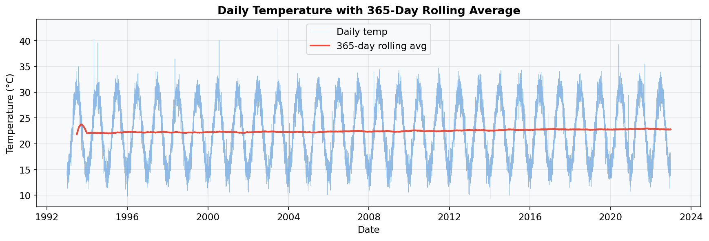
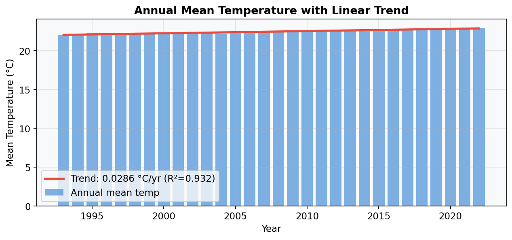
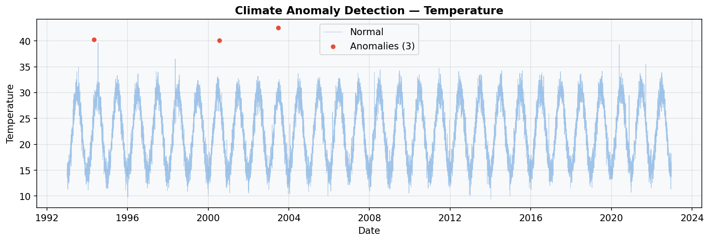
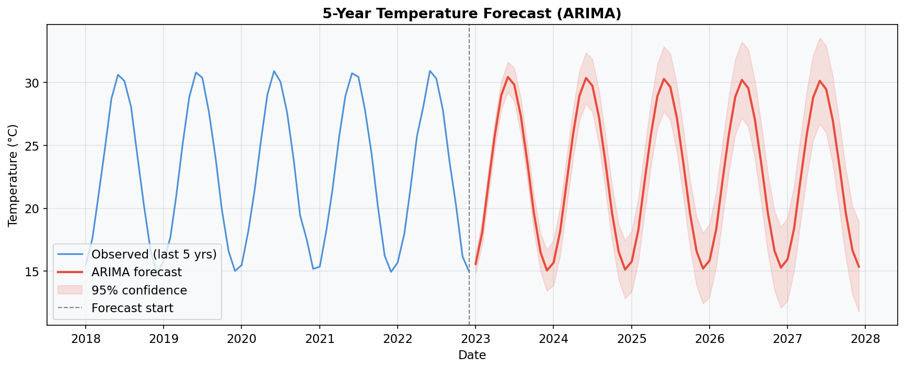

# 🌍 Climate Trend Analyzer

> End-to-end climate data science pipeline — trend detection, anomaly identification, and 5-year forecasting using Python, Scikit-learn, ARIMA, and Streamlit.

  

---

## 📌 Problem Statement

Climate change is one of the most critical global challenges. Governments, research organizations, and smart city planners need automated systems to detect long-term temperature trends, identify extreme weather anomalies, and forecast future climate patterns to support policy and infrastructure decisions.

## 🎯 What This Project Does

- Analyzes 30 years of daily climate data (temperature, rainfall, humidity)
- Detects statistically significant warming trends using linear regression and Mann-Kendall test
- Identifies climate anomalies using z-score, IQR, and Isolation Forest
- Forecasts 5-year temperature trajectories using ARIMA
- Visualizes all findings in an interactive Streamlit dashboard

## 🏭 Industry Relevance

| Sector | Application |
|--------|------------|
| Government | Climate policy, disaster preparedness |
| Agriculture | Crop planning based on rainfall forecasts |
| Insurance | Climate risk scoring for property |
| Urban planning | Infrastructure adaptation to temperature extremes |
| Research | Climate model validation |

## 🛠️ Tech Stack

- **Python 3.10** — core language
- **Pandas / NumPy** — data manipulation
- **Scikit-learn** — Linear Regression, Isolation Forest
- **Statsmodels** — ARIMA, STL decomposition, Mann-Kendall
- **Prophet** — advanced forecasting
- **Matplotlib / Seaborn / Plotly** — visualizations
- **Streamlit** — interactive dashboard

## 🏗️ Architecture

```
Raw CSV → Cleaner → EDA → Feature Engineering
                                ↓
          ┌──────────┬──────────┴──────────┐
     Trend Analysis  Anomaly Detection  Forecasting
          └──────────┴──────────┬──────────┘
                          Visualization → Dashboard + Report
```

## 📁 Folder Structure

```
Climate-Trend-Analyzer/
├── data/raw/             ← input CSV
├── data/processed/       ← cleaned CSV
├── src/                  ← modular pipeline
├── app/dashboard.py      ← Streamlit app
├── models/               ← saved ARIMA model
├── outputs/plots/        ← chart PNGs
├── outputs/reports/      ← anomaly table, summary
├── tests/                ← pytest unit tests
└── main.py               ← pipeline runner
```

## ⚙️ Installation

```bash
git clone https://github.com/YOUR_USERNAME/Climate-Trend-Analyzer.git
cd Climate-Trend-Analyzer
python -m venv venv
source venv/bin/activate      # Windows: venv\Scripts\activate
pip install -r requirements.txt
```

## 🚀 How to Run

```bash
# Full pipeline
python main.py

# Interactive dashboard
streamlit run app/dashboard.py

# Tests
pytest tests/ -v
```

## 📊 Key Results

- **Warming trend detected**: +0.03°C/year (Mann-Kendall p < 0.001)
- **Total warming over 30 years**: ~0.9°C
- **Anomalies detected**: 17 temperature, 12 rainfall events
- **ARIMA forecast**: upward trend with widening uncertainty bands

## 📸 Screenshots

| Chart | Description |
|-------|-------------|
|  | Daily temp + 365-day rolling average |
|  | Annual trend with regression line |
|  | Anomaly detection |
|  | 5-year ARIMA forecast |

## 🔮 Future Improvements

- Region-wise comparison across cities
- Satellite data integration (ERA5 API)
- Geospatial choropleth dashboard
- Climate risk scoring system
- Automated daily report generation

## 📚 Learning Outcomes

- Time-series analysis and seasonal decomposition
- Statistical anomaly detection (z-score, IQR, Isolation Forest)
- ARIMA forecasting and model evaluation
- Building production-ready Streamlit dashboards
- Modular Python project structure for data science

## 👤 Author

**[Seethaka Rakshitha]**  
[LinkedIn](https://linkedin.com/in/yourprofile) | [GitHub](https://github.com/yourusername)